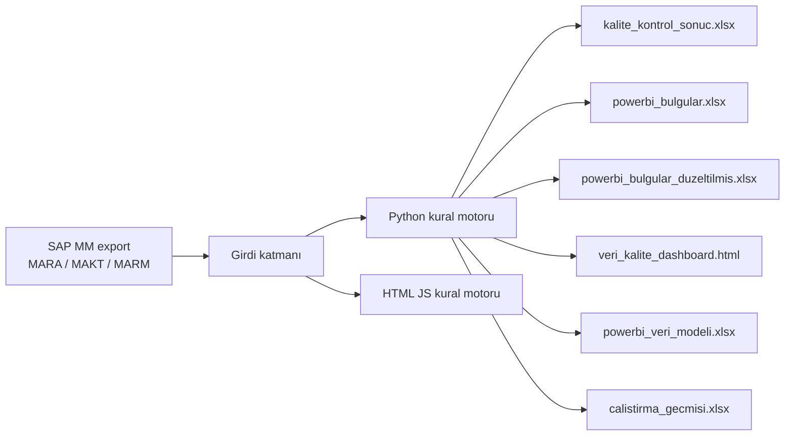

# SAP MM Malzeme Master Veri Kalite Kontrolü

Salt okunur SAP MM dışa aktarımlarını (MARA / MAKT / MARM) işleyen, altı iş kuralı üzerinden malzeme ana verisini denetleyen ve düzeltme önerisi üreten bağımsız kalite kontrol motoru.

Sistem canlı SAP’ye yazmaz. Yalnızca export dosyalarını okur; Excel raporları, tarayıcı paneli ve Power BI modeli üretir.

---

## Ne işe yarar?

Satılabilir ürün kodları (malzeme türü 0006 / 0007) ile bağlı oldukları referans üst kodlar (RC… / tür 0015) arasındaki alan uyumsuzluklarını, kısa metin adlandırma ihlallerini, paketleme sayacı sapmalarını, mükerrer üst kodları ve kod sonu–menşei uyuşmazlıklarını tespit eder.

Çıktılar hem yönetici özeti hem de MM17 / MASS ile uygulanabilir operasyonel aksiyon listesidir.

---

## Özellikler

- **Read-only denetim:** SAP’ye bağlanmaz; export dosyası yeterlidir.
- **Esnek girdi:** Ayrı dosyalar (`urun_kodlari.xlsx` + `ust_kodlar.xlsx`) veya tek birleşik liste (`birlesik_liste.xlsx`). XLSX / CSV. Kodlama denemesi: `utf-8-sig`, `utf-8`, `cp1254`, `latin-1`, `utf-16`.
- **Başlık onarımı:** Bozuk Türkçe karakterler (`Men?ei` → `Menşei`) ve otomatik EN / TR dil algılama.
- **Çift motor:** Python (Pandas) ile HTML paneldeki gömülü JavaScript motoru aynı kural kümesini uygular.
- **Otomatik düzeltme günlüğü:** Uygulanabilir bulgular `DÜZELTİLDİ`, insan kararı gerekenler `ELLE` işaretlenir.
- **Power BI:** Yıldız şema Excel modeli, DAX rehberi ve (ortam uygunsa) `.pbit` şablonu.
- **Kalite karnesi:** DAMA / ISO 25012 boyutları — Tamlık, Tutarlılık, Geçerlilik, Standart, Doğruluk, Benzersizlik, Uyum.
- **Çalıştırma tarihçesi:** Her koşum `calistirma_gecmisi.xlsx` dosyasına eklenir.

---

## Mimari



Motor canlı sistemi değiştirmez. Düzeltmeler yalnızca çıktı dosyalarında önerilir; SAP tarafındaki güncelleme kullanıcı tarafından MM17 / MASS ile yapılır.

---

## İş kuralları

Kapsam: ürün türleri **6 / 7**, üst kod türü **15**. Diğer türler hata sayılmaz, atlanır. `ÜB dzy.silme iştr.` dolu malzemeler silinmiş kabul edilir ve (silme kaskadı hariç) bulgu üretmez.

### K1 — Akıllı kod eşleşmesi

Ürün, `Temel malzeme` ile bağlı olduğu üst kodla beyaz listedeki alanlarda birebir karşılaştırılır:

`Raporlama Markası`, `Raporlama Alt Markası`, `Marka1`, `Marka2`, `Marka3`, `S&OP Kategorisi`, `Ürün Boyutu`, `Referans Ürün Boyutu`, `Varyant`, `SKU Grup`, `Kare Barkod`, `Ek Alan`

- `Kare Barkod` bayrak (`X` / boş) mantığıyla kıyaslanır.
- `SKU Grup` boşluğu hata sayılmaz; yalnızca iki taraf da doluyken ve farklıyken bulgu üretilir.
- **68 ön ek kuralı:** `68` ile başlayan kodların üst kodu olmamalıdır. Varsa K1 hatası üretilir ve bağın kaldırılması önerilir.
- **RC muafiyeti:** RC formatındaki üst kodlar geçerli referanstır. Kısmi export’ta listede yoksa “bulunamadı” hatası üretilmez.
- **Silme kaskadı:** Üst kod silinmek üzere işaretliyse bağlı tüm ürünler de silinmelidir. İşaret yoksa “işaret eksik”, varsa “silme işlemi tamamlanmalı”.

### K2 — Tanım ↔ ek veri alanı

Kısa metnin sonundaki kısaltmalar ile ilgili alanlar iki yönde denetlenir:

| Alan | Örnek kodlar |
|---|---|
| Pazar | RU, KZ, DE, TR, … |
| Menşei | sayısal: 10, 11, 20, 21, 30, … |
| Ek Alan | LF, QR, IHL, BK, E26, … |
| Ambalaj Tipi | SV, SP, DP, … |

- **Ölçü birimi filtresi:** `500 ML`, `1 GL` gibi sayı + birim ifadeleri kod denetimine takılmaz.
- **Tanım sonu yasak:** `T26` tanım sonunda bulunamaz; temizlenmiş tanım önerilir.
- **Ters yön:** `Ek Alan` dolu ama tanımın sonunda kod yoksa MM17 / MASS formatında tamamlanmış tanım üretilir.

### K3 — Yasaklı kelimeler

Tanımın hiçbir yerinde: `NEW`, `YENİ`, `YENI`, `2026`, `2027`.

`6` ve `7` yalnızca tanımın **en sonunda** bağımsız duruyorsa hatadır. Ortadaki varyant (`… CREAM 6 150X4…`) veya çarpan (`*6`) temizdir.

### K4 — Çokluk ↔ MARM sayacı

Tanım sonundaki koli / paket çarpanı (`…125G*8X12` → **12**), `marm.xlsx` içindeki alternatif ölçü birimi sayaç (`UMREZ`) değerlerinden biriyle eşleşmelidir.

MARA ürün hiyerarşisi (`PRDHA`) muaf listesindeki malzemeler kapsam dışıdır. MARM kaydı olmayan malzeme doğrulanamaz ve hata sayılmaz.

### K5 — Üst kod benzersizliği

İki farklı üst kod (RC), şu kombinasyonun tamamında birebir aynı olamaz:

`Marka1` + `Raporlama Markası` + `Raporlama Alt Markası` + `Varyant` + `Ürün Boyutu` + `S&OP Kategorisi` + MARM’dan doğrulanmış koli içi adet

Aynı parmak izine sahip üst kodlar ve bağlı alt tarif sayıları raporlanır.

### K6 — Kod sonu ↔ Menşei

Sayısal ürün kodunun son iki hanesi (`60002810` → `10`), `Menşei` alanındaki sayısal kodla eşleşmelidir.

| Kod | Anlam |
|---|---|
| 10 | TR |
| 11 | TR VAS |
| 20 | MY |
| 21 | MY VAS |
| 30 | RU |
| 31 | RU VAS |
| 40 | EG |
| 41 | EG VAS |
| 50 | ID |
| 99 | TG |

Boş veya uyumsuz menşei tespit edilir; alan kod sonuna göre eşitlenmesi önerilir. Üst kodlar (RC…) kapsam dışıdır.

### Bilgi — Alt tarifler

Aynı tanımı paylaşan farklı ürün kodları hata değildir; üst kodun alt tarifleri olarak kabul edilir. Veri sağlığı skorunu düşürmez, bilgi amaçlı listelenir.

---

## Girdiler

Motor, script ile **aynı klasördeki** dosyaları arar. Dosya adları kodun üstündeki `AYARLAR` bölümünden değiştirilebilir.

| Dosya | Zorunlu? | Açıklama |
|---|---|---|
| `urun_kodlari.xlsx` | Evet* | Ürün kodları (MARA + MAKT export) |
| `ust_kodlar.xlsx` | Evet* | Üst kodlar (RC…) |
| `birlesik_liste.xlsx` | Alternatif | Tek dosya: `RC` ile başlayan = üst kod, rakamla başlayan = ürün |
| `marm.xlsx` | K4 / K5 için önerilir | Alternatif ölçü birimleri (MATNR, MEINH, UMREZ, UMREN) |
| `ayarlar.xlsx` | Hayır | Kod listelerini genişletir (silmez). Sütunlar: `Grup`, `Değer`, `Metin` |
| `istisnalar.xlsx` | Hayır | Onaylı istisnalar. Sütunlar: `Malzeme`, `Kural` (`K1`…`K6` veya `HEPSİ`), `Onaylayan`, `Not` |

\* Ayrı dosyalar **veya** birleşik liste yeterlidir.

`ayarlar.xlsx` grupları: `YASAKLI`, `MENŞEİ`, `PAZAR`, `EK ALAN`, `AMBALAJ TİPİ`, `ÜRÜN TÜRÜ`, `ÜST TÜRÜ`, `TANIM SONU YASAK`.

Google Colab’da veri yoksa boş panel üretilir; yükleme tarayıcıdan yapılır.

---

## Çıktılar

| Dosya | İçerik |
|---|---|
| `kalite_kontrol_sonuc.xlsx` | Özet, genel durum, kural sayfaları, grafikler, kategori analizi |
| `powerbi_bulgular.xlsx` | Renk kodlu operasyonel aksiyon listesi |
| `powerbi_bulgular_duzeltilmis.xlsx` | Otomatik uygulanmış düzeltmeler + değişiklik günlüğü (`DÜZELTİLDİ` / `ELLE`) |
| `veri_kalite_dashboard.html` | Tarayıcı paneli; aynı kuralları istemci tarafında da çalıştırabilir |
| `powerbi_veri_modeli.xlsx` | Yıldız şema: Bulgular, Malzemeler, Kurallar, Kalite_Boyutlari, Kategoriler, Calistirma |
| `powerbi_rehber.md` | Power BI Desktop kurulum ve DAX ölçüleri |
| `calistirma_gecmisi.xlsx` | Koşum tarihçesi ve trend |

### Otomatik düzeltme / elle karar

| Kural | Otomatik (`DÜZELTİLDİ`) | Elle (`ELLE`) |
|---|---|---|
| K1 | Alan eşitleme, barkod bayrağı, 68’li kodda üst bağını kaldırma, silme kaskadı işareti | Üst kod boş veya listede yok |
| K2 | Alan doldurma veya tanım tamamlama | — |
| K3 | Yasaklı kelimeyi tanımdan çıkarma | — |
| K4 | Tek MARM değeri varsa tanımdaki `xN` | Birden çok MARM değeri |
| K5 | — | Üst kod birleştirme kararı |
| K6 | Menşei’yi kod sonuna eşitleme | — |

---

## Kurulum ve çalıştırma

Python 3.10+ önerilir.

```bash
pip install pandas openpyxl xlsxwriter numpy
```

Export dosyalarını script ile aynı klasöre koyun, ardından:

```bash
python "malzeme kalite kontrol (1).py"
```

İsteğe bağlı: dosyayı `malzeme_kalite_kontrol.py` olarak yeniden adlandırıp aynı komutu sade adla çalıştırabilirsiniz. Kod davranışını değiştirmez.

Çıktı HTML dosyasını tarayıcıda açın. Power BI için `powerbi_rehber.md` adımlarını izleyin.

### Power BI (kısa)

1. Python koşumu `powerbi_veri_modeli.xlsx` üretir.
2. Ortamda şablon üretici varsa `.pbit` dosyası da oluşur; Power BI Desktop ile açıp **Yükle** demeniz yeterlidir.
3. Şablon yoksa rehberdeki B yolu ile `powerbi_veri_modeli.xlsx` tablolarını (Bulgular → Malzemeler, Bulgular → Kurallar) elle bağlayın.

---

## Veri kalitesi boyutları

| Boyut | Soru | Kaynak kural |
|---|---|---|
| Tamlık | Zorunlu alan ve üst kod bağı dolu mu? | K1 (boş üst kod), K2 (doldurulmamış alan) |
| Tutarlılık | Ürün alanları üst kodla uyumlu mu? | K1 |
| Geçerlilik | Tanım ile ek veri alanı örtüşüyor mu? | K2 |
| Standart | Adlandırma kuralına uygun mu? | K3 |
| Doğruluk | Tanımdaki çokluk MARM sayacıyla örtüşüyor mu? | K4 |
| Benzersizlik | Her üst kodun parmak izi tekil mi? | K5 |
| Uyum | Kodun son iki hanesi menşei ile örtüşüyor mu? | K6 |

Genel veri sağlığı = en az bir K1–K6 hatası olmayan malzeme oranı. Alt tarifler bu skora dahil edilmez.

---

## Yapılandırma

Davranış, script içindeki `AYARLAR` bloğundan veya `ayarlar.xlsx` ile yönetilir. Sık kullanılan anahtarlar:

| Anahtar | Varsayılan | Anlam |
|---|---|---|
| `UST_KOD_ONEKI` | `RC` | Birleşik listede üst kod öneki |
| `USTKODSUZ_ONEKLER` | `["68"]` | Üst kodu olmaması gereken malzeme önekleri |
| `UST_KOD_YOKSA_RC_MUAF` | `True` | RC üst kod listede yoksa K1 “bulunamadı” üretme |
| `TANIM_SONU_YASAK` | `["T26"]` | Tanım sonunda yasak kodlar |
| `TERS_KONTROL` | `True` | Ek Alan dolu, tanımda kod yoksa bildir |
| `K6_AKTIF` | `True` | Menşei kuralını aç / kapa |
| `K4_MUAF_HIYERARSILER` | küme | K4’ten muaf `PRDHA` kodları |
| `DIL` | `AUTO` | Çıktı dili: `AUTO` / `TR` / `EN` |

Gömülü kurallar silinmez; `ayarlar.xlsx` yalnızca yeni kod ekler.

---

## Kapsam ve sınırlar

- Canlı SAP’ye yazma, RFC veya batch input yoktur.
- Analiz, yüklenen export’un kapsamıyla sınırlıdır.
- MARM dosyası yoksa K4 atlanır; K5 koli içi adet bileşeni zayıflar.
- Bu depo örnek master veri, logo veya kurumsal kimlik dosyası içermez. Kendi SAP export’unuzu kullanın; üçüncü taraf marka varlıklarını buraya koymayın.

---

## Teknoloji

- Python, Pandas, openpyxl, xlsxwriter
- İsteğe bağlı: Google Colab (`google.colab.files`)
- HTML / JavaScript panel (SheetJS ile istemci tarafı Excel okuma)
- Power BI Desktop (yıldız şema + DAX)

---

## Lisans ve kullanım

Kurum içi malzeme master veri yönetişimi için üretilmiştir. SAP, Power BI ve ilgili ürün adları sahiplerinin tescilli markalarıdır. Bu proje onlarla resmi bir ilişki iddia etmez.
